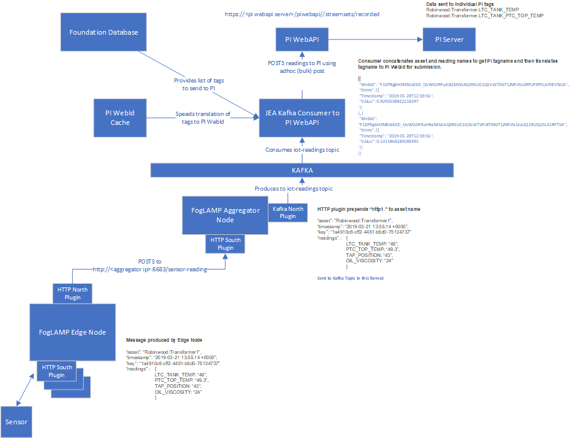

# Kafka Consumer to PI WebAPI

This project will consume FogLAMP asset readings placed in Kafka topic messages and place them into PI using the PI WebAPI


```
python kafka_consumer_piwebapi.py
```

